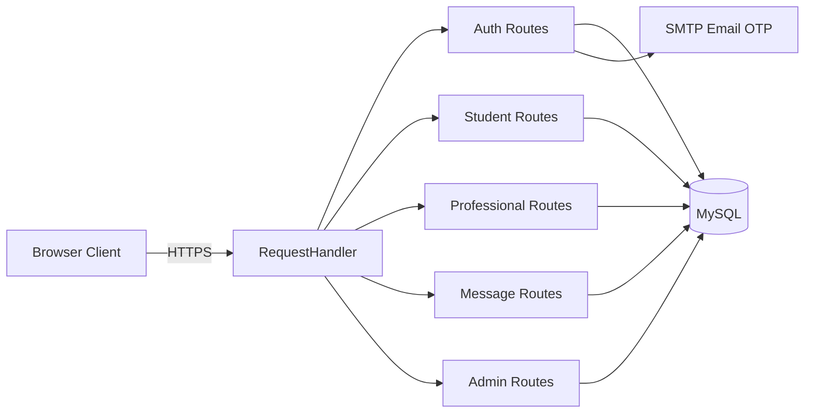

# Better Space - Final Year Project

Better Space is a web-based mental health support platform that connects students to verified mental health professionals.

The platform supports three roles:
- Student: search professionals, message, book sessions, leave feedback
- Professional: manage profile, submit verification documents, message students/admin
- Admin: verify professionals, manage users, review platform reports

This README is presentation-ready and includes:
- Full project explanation
- All major changes made during hardening/optimization
- Architecture and data flow
- Setup and run guide
- Panel Q&A bank

---

## 1. Problem Statement

Students often struggle to access trusted and affordable mental health care. Better Space solves this by:
- centralizing discovery and booking
- enforcing professional verification before public listing
- enabling safe communication between students, professionals, and admin

---

## 2. Current System Status (Updated)

The project has been upgraded significantly in security, reliability, and performance.

### Major delivered improvements

1. Admin authentication moved from client-side checks to backend JWT authentication.
2. Hardcoded admin credentials were removed from login flow and replaced with DB-backed verification.
3. Protected admin APIs now require admin JWT tokens.
4. Student/professional APIs now enforce ownership checks to prevent IDOR.
5. Message sender spoofing was blocked by server-side sender assignment from JWT identity.
6. Forgot Password flow was added with OTP email delivery and password reset endpoints.
7. OTP sending was made asynchronous to reduce login/registration latency.
8. OTP verification now enforces expiry and invalid attempt limits.
9. Backend switched to ThreadingHTTPServer to improve page asset loading speed.
10. TLS context was optimized (TLS 1.2+, modern ciphers, session ticket support).
11. Static file cache headers were added for assets to improve page transitions.
12. Admin page logout behavior was fixed consistently across admin sections.
13. Admin login auto-redirect now skips directly to users page if session token is present.
14. Student admin-message UX issue fixed: input clears after successful send.
15. AES-GCM message encryption added: all messages (student–professional and admin) are encrypted at rest and decrypted transparently on read. Legacy plaintext rows are handled gracefully.
16. Unread-dot indicator system overhauled across admin, student, and professional messaging pages: dots are now driven purely by incoming-sender server timestamps, stale localStorage values are sanitised with a safe numeric parser, client-clock writes were removed, and first-load state is initialised from real server data.
17. Conversation list rows now build DOM elements safely with `textContent` instead of injecting participant names directly into innerHTML, eliminating HTML injection risk.
18. Admin login auto-redirect changed to a simpler synchronous check (no async token probe) because admin APIs already enforce JWT on every request.

---

## 3. Tech Stack and Why

- Backend: Python (http.server + custom router)
- Database: MySQL
- Frontend: HTML, CSS, Vanilla JavaScript
- Auth: JWT (PyJWT)
- Password hashing: bcrypt
- Email OTP: SMTP (Gmail) via smtplib
- HTTPS: Python ssl module with local certs

### Why this stack

- It demonstrates core web fundamentals without relying on heavy frameworks.
- The custom router in Backend/routes/request_handler.py shows direct understanding of request lifecycle.
- MySQL provides strong relational integrity for role-based data.

---

## 4. High-Level Architecture



### Entry point

- Backend/app.py
- Uses ThreadingHTTPServer
- Wraps socket with TLS context and certificates in Backend/certs/

---

## 5. Project Structure

- Backend/app.py: HTTPS server bootstrap
- Backend/config.py: DB and security config from environment variables
- Backend/routes/request_handler.py: central routing and static serving
- Backend/routes/auth.py: register/login/OTP/forgot-password/reset-password
- Backend/routes/admin.py: admin login, verification, reports, user management
- Backend/routes/messages.py: student-professional and admin messaging
- Backend/routes/student.py: student profile/messages/sessions/reviews
- Backend/routes/professionals.py: professional profile/messages/sessions/verification upload
- Backend/routes/sessions.py: slot lookup and booking
- Backend/utils/security.py: JWT, validation, rate limiting
- Backend/utils/email.py: OTP email sending
- Backend/utils/file_upload.py: file validation and sanitization
- Database/schema.sql: schema and constraints
- Frontend/assets/pages/: role-based page templates
- Frontend/assets/js/: role-based client scripts
- run.ps1: start helper script

---

## 5.1 Major Functionalities: File and Line Map

Use this map during presentation to quickly show where each core feature is implemented.

### Backend core

| Functionality | File | Key line(s) |
|---|---|---|
| HTTPS server bootstrap and threaded serving | Backend/app.py | 6, 22 |
| JWT creation | Backend/utils/security.py | 18 |
| JWT verification | Backend/utils/security.py | 33 |
| Global auth/role guard helper | Backend/routes/request_handler.py | 51 |
| Auth/role guard helper | Backend/routes/request_handler.py | 51 |
| Route mapping for admin login | Backend/routes/request_handler.py | 357 |
| Route mapping for forgot/reset password | Backend/routes/request_handler.py | 361, 363 |
| Route mapping and sender enforcement for chat | Backend/routes/request_handler.py | 385 |
| Route mapping and ownership enforcement for booking | Backend/routes/request_handler.py | 398 |

### Authentication and OTP

| Functionality | File | Key line(s) |
|---|---|---|
| OTP expiry configuration | Backend/routes/auth.py | 18 |
| OTP max attempts configuration | Backend/routes/auth.py | 19 |
| Async OTP send trigger | Backend/routes/auth.py | 21 |
| OTP storage helper | Backend/routes/auth.py | 26 |
| OTP verification helper (expiry + attempts checks) | Backend/routes/auth.py | 37, 43, 48 |
| OTP verification endpoint logic | Backend/routes/auth.py | 154 |
| Login endpoint logic | Backend/routes/auth.py | 191 |
| Forgot password endpoint logic | Backend/routes/auth.py | 434 |
| Reset password endpoint logic | Backend/routes/auth.py | 514 |
| SMTP email sender utility | Backend/utils/email.py | 9 |

### Admin and reporting

| Functionality | File | Key line(s) |
|---|---|---|
| Admin DB login and token issue | Backend/routes/admin.py | 13 |
| Admin token verification helper | Backend/routes/admin.py | 88 |
| Registrations report query endpoint | Backend/routes/admin.py | 366 |
| Sessions report query endpoint | Backend/routes/admin.py | 402 |
| Verification report query endpoint | Backend/routes/admin.py | 445 |
| Feedback report query endpoint | Backend/routes/admin.py | 485 |
| Messaging report query endpoint | Backend/routes/admin.py | 520 |

### Messaging, sessions, and verification workflow

| Functionality | File | Key line(s) |
|---|---|---|
| Admin message auth helper | Backend/routes/messages.py | 10 |
| AES-GCM message encryption helper | Backend/utils/message_encryption.py | 60 |
| Message decryption on read (all endpoints) | Backend/routes/messages.py | 14 |
| Get admin conversations/messages | Backend/routes/messages.py | 171 |
| Send admin message (encrypted) | Backend/routes/messages.py | 231 |
| Student-professional conversation fetch (decrypted) | Backend/routes/messages.py | 374 |
| Student-professional message send (encrypted) | Backend/routes/messages.py | 405 |
| Available slots retrieval | Backend/routes/sessions.py | 9 |
| Session booking | Backend/routes/sessions.py | 42 |
| Professionals listing for search | Backend/routes/professionals.py | 18 |
| Professional profile/messages/sessions retrieval | Backend/routes/professionals.py | 80, 166, 207 |
| Professional verification file upload handler | Backend/routes/professionals.py | 451 |
| Student profile/messages/sessions retrieval | Backend/routes/student.py | 9, 86, 127 |
| Student review submission | Backend/routes/student.py | 170 |

### Frontend auth and API utilities

| Functionality | File | Key line(s) |
|---|---|---|
| Shared API utility configuration | Frontend/assets/js/utils/api.js | 7 |
| Generic API request wrapper with 401 redirect fix | Frontend/assets/js/utils/api.js | 87 |
| GET and POST helpers | Frontend/assets/js/utils/api.js | 147, 154 |
| FormData upload helper | Frontend/assets/js/utils/api.js | 175 |
| Shared login and OTP helpers | Frontend/assets/js/utils/api.js | 182, 193 |
| Shared logout helper (fixed redirect path) | Frontend/assets/js/utils/api.js | 225 |
| Shared unread-dot navbar indicator | Frontend/assets/js/utils/message-indicator.js | 1 |
| Safe numeric timestamp parser (safeMs) | Frontend/assets/js/student/student-messaging.js | ~56 |
| Incoming-sender unread count (student) | Frontend/assets/js/student/student-messaging.js | ~93 |
| Safe numeric timestamp parser (safeMs) | Frontend/assets/js/professional/professional-messaging.js | ~56 |
| Incoming-sender unread count (professional) | Frontend/assets/js/professional/professional-messaging.js | ~93 |
| Admin conversation unread count (incoming-only) | Frontend/assets/js/admin/admin-messaging.js | ~79 |
| Admin login auto-redirect (sync session check) | Frontend/assets/js/admin/admin-login.js | 4 |
| Admin token save on successful login | Frontend/assets/js/admin/admin-login.js | 69 |
| Admin users page auth + logout handler | Frontend/assets/js/admin/admin-users.js | 3, 22 |
| Admin verification page auth + logout handler | Frontend/assets/js/admin/admin-verification.js | 4, 23 |
| Admin messaging page auth + logout handler | Frontend/assets/js/admin/admin-messaging.js | 2, 66 |
| Admin reports page auth + authenticated fetch + logout | Frontend/assets/js/admin/admin-reports.js | 2, 17, 84 |
| Logout fallback in admin users page HTML | Frontend/assets/pages/admin/users.html | 26 |
| Logout fallback in admin verification page HTML | Frontend/assets/pages/admin/verification.html | 31 |
| Logout fallback in admin messaging page HTML | Frontend/assets/pages/admin/messaging.html | 26 |
| Logout fallback in admin reports page HTML | Frontend/assets/pages/admin/reports.html | 27 |

---

## 5.2 Connection Map (End-to-End)

This section shows how modules connect from UI events to backend routes and database operations.

### A. Student/professional login and OTP to JWT

| Step | Connection | File and line(s) |
|---|---|---|
| 1 | Frontend login helper calls POST /api/login | Frontend/assets/js/utils/api.js:182 |
| 2 | Router dispatches login request | Backend/routes/request_handler.py:355 |
| 3 | Auth login handler validates credentials and triggers OTP | Backend/routes/auth.py:191 |
| 4 | Async email utility sends OTP | Backend/routes/auth.py:21 -> Backend/utils/email.py:9 |
| 5 | Frontend OTP helper calls POST /api/verify-otp | Frontend/assets/js/utils/api.js:193 |
| 6 | On 401 response, clearAuth() redirects to correct login path | Frontend/assets/js/utils/api.js:117 |
| 6 | Router dispatches OTP verification | Backend/routes/request_handler.py:359 |
| 7 | OTP verification returns JWT token | Backend/routes/auth.py:154 -> Backend/utils/security.py:18 |

### B. Admin login and protected admin access

| Step | Connection | File and line(s) |
|---|---|---|
| 1 | Admin login page submits credentials | Frontend/assets/js/admin/admin-login.js:49 |
| 2 | Router dispatches POST /api/admin/login | Backend/routes/request_handler.py:357 |
| 3 | Admin login validates against Admins table and returns admin JWT | Backend/routes/admin.py:13 |
| 4 | Admin token stored in sessionStorage | Frontend/assets/js/admin/admin-login.js:69 |
| 5 | Admin pages verify token on load | Frontend/assets/js/admin/admin-users.js:3, Frontend/assets/js/admin/admin-verification.js:4, Frontend/assets/js/admin/admin-messaging.js:2, Frontend/assets/js/admin/admin-reports.js:2 |
| 5 | Admin API handlers validate token before query/response | Backend/routes/admin.py:88 |

### C. Messaging connection (student <-> professional)

| Step | Connection | File and line(s) |
|---|---|---|
| 1 | Frontend sends POST /api/messages | Frontend/assets/js/utils/api.js:154 |
| 2 | Router applies auth and forces sender identity from JWT | Backend/routes/request_handler.py:385 |
| 3 | Message text is AES-GCM encrypted before INSERT | Backend/routes/messages.py:437 |
| 4 | Message write handled in messages module | Backend/routes/messages.py:405 |
| 5 | Conversation read via GET /api/messages | Backend/routes/request_handler.py:237 -> Backend/routes/messages.py:374 |
| 6 | Messages decrypted on read before JSON response | Backend/routes/messages.py:14 |
| 7 | Data stored/read from Messages table | Database/schema.sql:57 |

### D. Admin messaging connection

| Step | Connection | File and line(s) |
|---|---|---|
| 1 | Admin messaging UI loads thread list with Authorization header | Frontend/assets/js/admin/admin-messaging.js:76 |
| 2 | Router dispatches GET /api/admin/messages | Backend/routes/request_handler.py:264 |
| 3 | Admin messages fetched with admin token verification and decrypted | Backend/routes/messages.py:171, Backend/routes/messages.py:14 |
| 4 | Admin sends reply (encrypted) via POST /api/admin/messages | Frontend/assets/js/admin/admin-messaging.js:215 -> Backend/routes/request_handler.py:376 -> Backend/routes/messages.py:231 |
| 5 | Unread dot appears for each unread admin thread; cleared on open | Frontend/assets/js/admin/admin-messaging.js:101 |
| 6 | Data stored/read from AdminMessages table | Database/schema.sql:73 |

### E. Session booking connection

| Step | Connection | File and line(s) |
|---|---|---|
| 1 | Frontend requests available slots | Backend/routes/request_handler.py:286 |
| 2 | Slots handler reads ProfessionalSchedule | Backend/routes/sessions.py:9 |
| 3 | Frontend books session via POST /api/sessions | Backend/routes/request_handler.py:398 |
| 4 | Router overrides student_id from JWT before booking | Backend/routes/request_handler.py:402 |
| 5 | Booking handler writes appointment and updates slot state | Backend/routes/sessions.py:42 |
| 6 | Data persisted in ProfessionalSchedule and SessionAppointments | Database/schema.sql:36, Database/schema.sql:46 |

### F. Professional verification upload connection

| Step | Connection | File and line(s) |
|---|---|---|
| 1 | Frontend sends FormData using apiPostFormData | Frontend/assets/js/utils/api.js:175 |
| 2 | Router detects multipart/form-data and dispatches verification upload | Backend/routes/request_handler.py:331, Backend/routes/request_handler.py:333 |
| 3 | Verification upload handler validates file extension (dot-stripped), size, path traversal | Backend/routes/professionals.py:262 |
| 4 | Verification metadata stored in VerificationDocuments table (ProfessionalID, FilePath, OriginalFileName) | Database/schema.sql:24 |
| 5 | Admin review endpoint returns pending verification list | Backend/routes/request_handler.py:261 -> Backend/routes/admin.py:125 |

### G. Forgot password and reset connection

| Step | Connection | File and line(s) |
|---|---|---|
| 1 | Frontend calls POST /api/forgot-password | Backend/routes/request_handler.py:361 |
| 2 | Forgot-password handler generates and stores reset OTP | Backend/routes/auth.py:434, Backend/routes/auth.py:26 |
| 3 | Async sender emails reset OTP | Backend/routes/auth.py:21 -> Backend/utils/email.py:9 |
| 4 | Frontend calls POST /api/reset-password | Backend/routes/request_handler.py:363 |
| 5 | Reset handler verifies OTP and updates hashed password | Backend/routes/auth.py:514 |

### H. Logout connection and fallback

| Step | Connection | File and line(s) |
|---|---|---|
| 1 | Admin JS logout handlers remove token and redirect | Frontend/assets/js/admin/admin-users.js:22, Frontend/assets/js/admin/admin-verification.js:23, Frontend/assets/js/admin/admin-messaging.js:66, Frontend/assets/js/admin/admin-reports.js:17 |
| 2 | HTML fallback also removes token even if script fails | Frontend/assets/pages/admin/users.html:26, Frontend/assets/pages/admin/verification.html:31, Frontend/assets/pages/admin/messaging.html:26, Frontend/assets/pages/admin/reports.html:27 |
| 3 | After logout, admin API endpoints still reject requests missing valid token | Backend/routes/admin.py:88 |

---

## 6. Database Design (Core Tables)

Main tables:
- Students
- MentalHealthProfessionals
- VerificationDocuments
- ProfessionalSchedule
- SessionAppointments
- FeedbackRatings
- Messages
- Admins
- AdminMessages

### Key relationship intent

- Professionals must be Verified before they are bookable/listed.
- SessionAppointments link student + professional + schedule slot.
- Messages holds student-professional chat; AdminMessages handles admin support chats.

---

## 7. Security Model (Current)

### Authentication and authorization

- JWT issued after OTP verification.
- Role checks enforced in backend for protected endpoints.
- Ownership checks enforce that users can only access their own records.
- Admin-only page and API controls enforced server-side.

### Data protection

- Passwords hashed with bcrypt.
- All chat messages (student–professional and admin) are encrypted at rest with AES-GCM before database write and decrypted transparently on read. Existing plaintext rows are returned as-is for backward compatibility.
- Encryption key is configured via `MESSAGE_ENCRYPTION_KEY_B64` environment variable; falls back to a key derived from `SECRET_KEY` if not set.
- TLS enabled for all traffic.
- Security headers set globally (HSTS, CSP, X-Frame-Options, nosniff, Referrer-Policy).

### Abuse controls

- Rate limiting on login and password reset attempts.
- OTP expiration and attempt limits.
- Input and file upload validation.

### Important hardening outcomes

- No more client-side-only admin auth bypass.
- Admin APIs enforce JWT on every request; unauthenticated calls receive 401/403.
- No sender impersonation in messaging.
- Reduced risk of IDOR on student/professional data routes.
- Messages encrypted at rest; plaintext never stored for new rows.
- Participant names in conversation lists rendered as `textContent` (not innerHTML), preventing HTML injection.
- Unread-dot logic hardened with safe numeric parsers so corrupt or missing localStorage values cannot produce `NaN` and break indicator state.

---

## 8. Performance Optimizations Delivered

1. Switched to ThreadingHTTPServer for concurrent requests.
2. Optimized TLS configuration and enabled practical session behavior.
3. Added cache-control for static assets.
4. Made OTP email sending asynchronous so login/register responses are not blocked by SMTP latency.
5. Added token verification caching in security utilities to reduce repetitive JWT decode overhead.

---

## 9. API Overview (Selected)

### Auth
- POST /api/register
- POST /api/login
- POST /api/verify-otp
- POST /api/forgot-password
- POST /api/reset-password

### Admin
- POST /api/admin/login
- GET /api/admin/users
- GET /api/admin/verifications
- POST /api/admin/verify-professional
- GET /api/admin/reports/registrations
- GET /api/admin/reports/sessions
- GET /api/admin/reports/verification
- GET /api/admin/reports/feedback
- GET /api/admin/reports/messaging

### Messaging and sessions
- GET /api/messages
- POST /api/messages
- GET /api/sessions/slots
- POST /api/sessions

### Student/professional profile data
- GET /api/student/profile
- GET /api/student/messages
- GET /api/student/sessions
- POST /api/student/reviews
- GET /api/professional/profile
- GET /api/professional/messages
- GET /api/professional/sessions

---

## 10. Authentication Flows

### Student/professional login flow

1. User submits email + password.
2. Backend validates credentials.
3. OTP generated and sent by email (async).
4. User submits OTP.
5. Backend verifies OTP and issues JWT.
6. Frontend stores JWT and attaches Authorization header for protected requests.

### Admin login flow

1. Admin submits username + password.
2. Backend validates against Admins table.
3. Legacy plaintext values are migrated to bcrypt hash on successful login.
4. JWT issued with admin role.
5. Admin pages and APIs require valid admin JWT.

---

## 11. Setup and Run

### Prerequisites

- Python 3.x
- MySQL server
- Virtual environment in project root (venv)
- Database initialized from Database/schema.sql

### Environment variables (recommended)

Create .env with at least:

- DB_HOST
- DB_USER
- DB_PASSWORD
- DB_NAME
- DB_PORT
- SECRET_KEY
- ALLOWED_ORIGIN
- EMAIL_USER
- EMAIL_PASSWORD
- SMTP_SERVER
- SMTP_PORT
- MAX_FILE_SIZE
- ALLOWED_EXTENSIONS
- MESSAGE_ENCRYPTION_KEY_B64 *(32-byte key as urlsafe base64; derived from SECRET_KEY if omitted)*
- MESSAGE_ENCRYPTION_KEY_ID *(defaults to "v1"; increment when rotating keys)*

### Install dependencies

If requirements.txt is not UTF-8 on your machine, install manually:
- bcrypt==5.0.0
- mysql-connector-python==9.5.0
- python-dotenv==1.2.1
- cryptography==42.0.8
- PyJWT

### Start the app

```powershell
.\run.ps1 -Port 8443
```

Then open:

https://localhost:8443

---

## 12. Demo Script for Panel Presentation

Suggested 6-8 minute live demo:

1. Landing page and role separation.
2. Student registration/login with OTP verification.
3. Professional registration + document upload (Pending state).
4. Admin login and professional approval.
5. Student search, message, and book session.
6. Professional sees session and replies in messaging.
7. Student leaves rating/review post-session.
8. Admin reports dashboard.
9. Security proof point: admin APIs reject requests without a valid admin JWT; messages display as readable text (decrypted transparently).

---

## 13. Panel Q&A Bank (Presentation Answers)

### Q1: Why build on Python http.server instead of Flask/Django?
A: To demonstrate core backend fundamentals: manual routing, headers, static serving, and request parsing. It gave us deeper control during security hardening and performance tuning.

### Q2: How do you protect passwords?
A: Passwords are hashed with bcrypt before storage. No plaintext passwords are stored for student/professional accounts.

### Q3: How do you prevent admin auth bypass now?
A: Admin auth is server-side with JWT tokens. Every admin API endpoint verifies the token before processing. The admin login page also skips straight to the users page if a valid session token is already present.

### Q4: How do you prevent users from reading other users' data?
A: Ownership checks compare JWT identity against requested resource IDs in the request handler.

### Q5: What prevents message impersonation?
A: Sender identity is enforced server-side from JWT role; client-supplied sender is not trusted.

### Q6: What caused the original login-to-OTP lag?
A: SMTP calls were synchronous in the request path. Async background sending removed that blocking delay.

### Q7: How do you secure file uploads?
A: Extension/type/size checks, filename sanitization, and path traversal prevention before saving.

### Q8: What is your session/auth strategy?
A: Stateless JWT with role-based checks. Frontend sends Authorization Bearer token for protected APIs.

### Q9: How is HTTPS configured?
A: TLS is configured in backend startup using cert.pem/key.pem with modern TLS settings.

### Q10: What DB constraints improve integrity?
A: Foreign keys across users, schedules, sessions, messages, and feedback tables prevent orphan records.

### Q11: What rate limits exist?
A: Login and reset endpoints are rate-limited by IP windows to reduce brute-force risk.

### Q12: How do you ensure OTP validity?
A: OTPs now have expiry time and max invalid attempts before rejection.

### Q13: How do you handle unauthorized API access in UI?
A: Frontend auth guards and 401/403 handling clear tokens and redirect to login.

### Q14: Is this production-ready?
A: It is secure for academic demonstration and local deployment. For production, migrate in-memory stores to Redis and add robust audit logging/monitoring.

### Q15: Why not store OTP in DB?
A: In-memory storage is simple and fast for this scope. For scale/HA, Redis or DB-based OTP with TTL should be used.

### Q16: What are current limitations?
A: In-memory OTP/token cache is process-local; no distributed state. Also, some legacy scripts still need full test coverage after hardening.

### Q17: What improvements would you do next?
A: Redis-backed rate limiting/OTP, refresh token rotation, centralized auth middleware, automated tests, and deployment hardening.

### Q18: What was the biggest bug fixed recently?
A: The unread-dot indicator system was unreliable because seen timestamps were compared against all messages rather than only incoming messages, and corrupt localStorage values could produce `NaN`, making dots appear or disappear randomly. Fixed by: tracking unread state against incoming-sender timestamps only, adding a safe numeric parser for all localStorage reads/writes, and removing all client-clock writes from read-state logic.

### Q19: How do you explain your architecture in one sentence?
A: A custom HTTPS Python server routes role-based APIs to MySQL-backed modules with JWT auth, OTP verification, and strict admin/protected access controls.

### Q20: What proves this is not just a frontend prototype?
A: Core business rules (verification, ownership checks, sender identity, booking restrictions) are enforced server-side. Messages are encrypted at rest using AES-GCM on the backend before database write, proving the backend does real data handling rather than just passing through frontend input.

### Q21: How does message encryption work?
A: When any message is sent, the backend encrypts the text with AES-GCM using a 32-byte key (configurable via environment variable). The stored value is a prefixed base64 payload containing the nonce and ciphertext. On read, the backend decrypts transparently before returning JSON. Legacy plaintext rows are returned as-is so existing data still works.

### Q22: What happens if the encryption key changes?
A: The system supports a keyring with multiple key IDs. Old rows are decrypted with the key ID embedded in their prefix, while new rows use the current active key. Rotating the key is done by setting a new `MESSAGE_ENCRYPTION_KEY_B64` and `MESSAGE_ENCRYPTION_KEY_ID`, keeping old keys in `MESSAGE_ENCRYPTION_PREVIOUS_KEYS`.

---

## 14. Recent Change Log (Summary)

- Added backend admin login endpoint and JWT issuance.
- Protected admin endpoints with token verification.
- Added robust admin frontend auth guards and logout handling.
- Added cache controls and security headers improvements.
- Upgraded server to threaded mode and tuned TLS settings.
- Implemented forgot password and reset password flows.
- Made OTP sending asynchronous.
- Added OTP expiry and retry limits.
- Added ownership enforcement across student/professional APIs.
- Fixed message input clearing issue in student admin-chat flow.
- Added AES-GCM message encryption for all chat messages (student–professional and admin) with backward-compatible plaintext fallback.
- Added `message_encryption.py` utility with keyring support for safe key rotation.
- Overhauled unread-dot indicator: incoming-only timestamps, safe `safeMs()` parser everywhere, client-clock writes removed.
- Admin login auto-redirect simplified (async probe removed; direct session check).
- Conversation list rows now use DOM construction with `textContent` instead of innerHTML injection.
- Professional verification upload: file extension handling fixed (dot-stripping) and simplified INSERT matches current schema.
- `api.js` 401 redirect path corrected to `/assets/pages/shared/login.html`.
- `admin-users.js` error messages replaced with safe DOM injection (no `innerHTML +=`).

---

## 15. Evaluation Checklist for Supervisors/Panel

Use this quick checklist during assessment:

- Functional role flows: Student, Professional, Admin
- Professional verification workflow
- Secure login + OTP + JWT
- Admin APIs reject unauthenticated/unauthorized requests (401/403)
- Student cannot access another student's profile via ID change
- Messaging works both directions (messages decrypted and displayed correctly)
- Unread-dot indicators appear and clear correctly on all messaging pages
- Session booking updates availability correctly
- Reports load for admin only
- HTTPS traffic only
- App starts cleanly using run.ps1
- No plaintext passwords or unencrypted messages written to database for new data

---

## 16. Authors and Academic Context

This system was developed as a final year project to demonstrate:
- Software engineering fundamentals
- Full-stack integration
- Security hardening and threat mitigation
- Performance tuning in a custom backend
- Role-based product design for real-world impact

---

If needed, this README can be split into:
- User manual
- Technical report appendix
- Viva/panel speaking notes

For now, it is intentionally unified so you can present and defend the entire system from one document.
